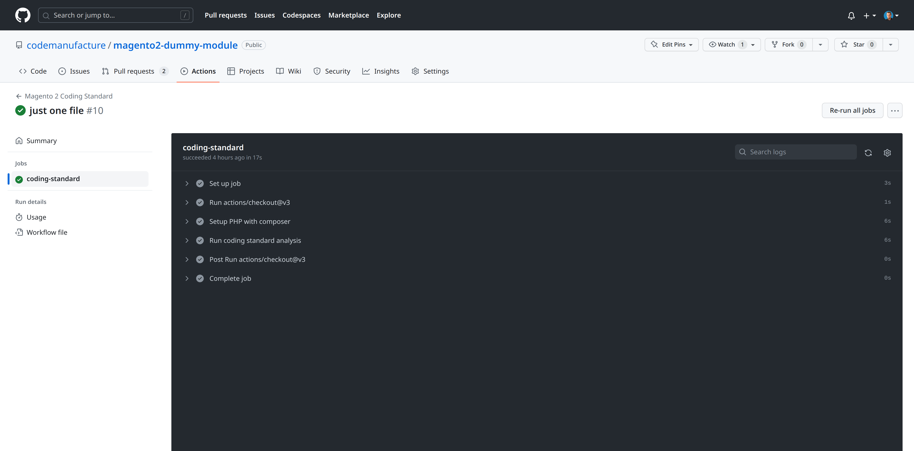
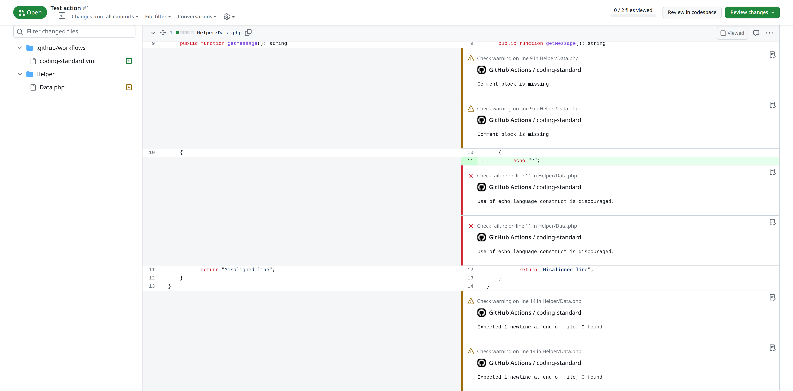

# Magento 2 Coding Standard GitHub Action

This [GitHub Action](https://github.com/actions) performs static code analysis using [PHP_CodeSniffer](https://github.com/squizlabs/PHP_CodeSniffer) and [Magento Coding Standard](https://github.com/magento/magento-coding-standard).


[](./LICENSE)

## Usage

Create `.github/workflows/coding-standard.yml` in your repository with the following contents:

```yaml
name: "Magento 2 Coding Standard"
on:
  push:
jobs:
  coding-standard:
    runs-on: ubuntu-latest
    steps:
    - uses: actions/checkout@v3
      with:
        fetch-depth: 0   # Depth is needed for PR violation reports
    - name: Setup PHP with composer
      uses: shivammathur/setup-php@v2
      with:
        php-version: 8.1
        tools: composer:2.3, phpcs:3.6
    - name: Run coding standard analysis
      uses: codemanufacture/magento-coding-standard-action@v1
```



## Features

* By default installs Magento coding standard.
* Allows to provide custom coding standard like [MRM Commerce](https://github.com/mrm-commerce/magento-coding-standard-phpcs)
* Exposes most of PHP_Codesniffer parameters.
* Allows to specify severity level.
* In pull requests an analysis is limited to modified files.
* Coding standard violations are reported next to offending code:


## Inputs (specify using with:)

| Option                    | Default value                   | Description                                                                                          |
|---------------------------|---------------------------------|------------------------------------------------------------------------------------------------------|
| `standard`                | "Magento2"                      | The name or path of the coding standard to use                                                       |
| `severity`                | no value                        | The minimum severity required to display an error or warning                                         |
| `warning_severity`        | no value                        | The minimum severity required to display warning                                                     |
| `error_severity`          | no value                        | The minimum severity required to display error                                                       |
| `verbosity`               | no value                        | -v Print processed files -vv Print ruleset and token output -vvv  Print sniff processing information |
| `report_style`            | "checkstyle"                    | Code Sniffer built-in reporter or a path to a custom report class                                    |
| `processes`               | 1                               | How many files should be checked simultaneously                                                      |
| `install_coding_standard` | true                            | Installs coding standard when set to true                                                            |
| `coding_standard_package` | magento/magento-coding-standard | Composer package name of coding standard to install                                                  |
| `coding_standard_version` | "*"                             | Lastest version installed by setting "*"                                                             |
| `extensions`              | "php"                           | A comma separated list of file extensions to check                                                   |
| `phpcs_path`              | "phpcs"                         | Path to Code Sniffer binary                                                                          |
| `file_list`               | $GITHUB_WORKSPACE               | Working directory or file list to analyse                                                            |
| `ignore_errors_on_exit`   | 0                               | Ignoring errors when generating the exit code when set to `1`                                        |
| `ignore_warnings_on_exit` | 0                               | Ignoring warnings when generating the exit code when set to `1`                                      |
| `ignore`                  | no value                        | A comma separated list of patterns to ignore files and directories                                   |
| `pr_modified_files_only`  | "true"                          | Restricts analysis to modified files in a pull request                                                                                                     |

See [action.yml](./action.yml).

## Goals of this actions are:

* Do one thing only - run coding standard analysis
* Provide flexibility
* Low level of maintenance
* Future proof
* Semantic versioning
* Automated tests
